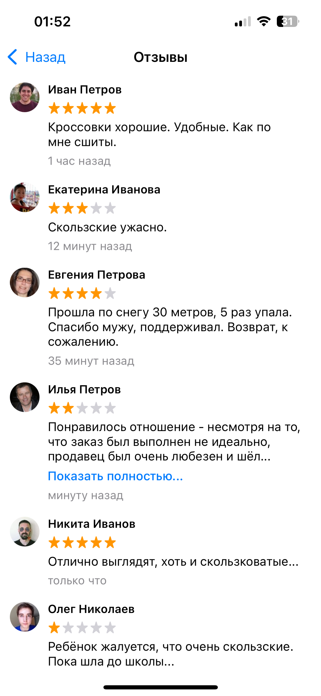

# ReviewsApp
Тестовое задание в команду ВК.

### Реализация функций
- Доделана вёрстка ячейки отзыва (минимальный вариант).
- Добавлена ячейка с общим количеством отзывов.
- Доделана работа кнопки «Показать полностью...».
- Реализована асинхронная загрузка изображений аватаров пользователей (URLSession с использованием URLCache).

### Улучшения
- Улучшение UI-перформанса (используя GCD симулированная задержка сети, чтение файла, парсинг JSON и маппинг были перенесены в фоновый поток).
- Оптимизировано создание и кэширование RatingRenderer, переход на паттерн Singleton.
- Рефакторинг ReviewCellLayout с ленивой инициализацией.
- Добавлено кэширование placeholder-изображения аватара, чтобы избежать повторных вызовов UIImage(named:).
- Исправлены утечки памяти.

### Скриншот

